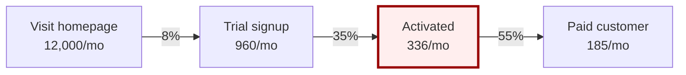
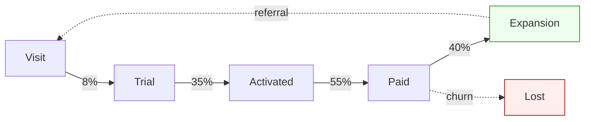
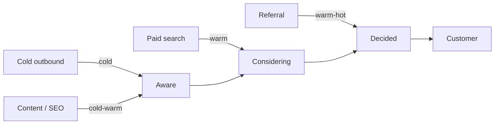
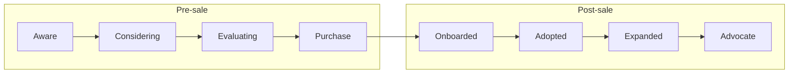
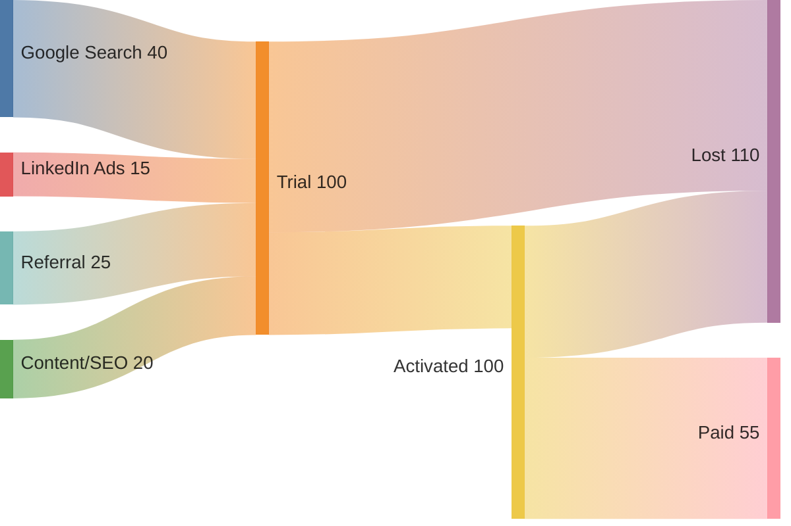
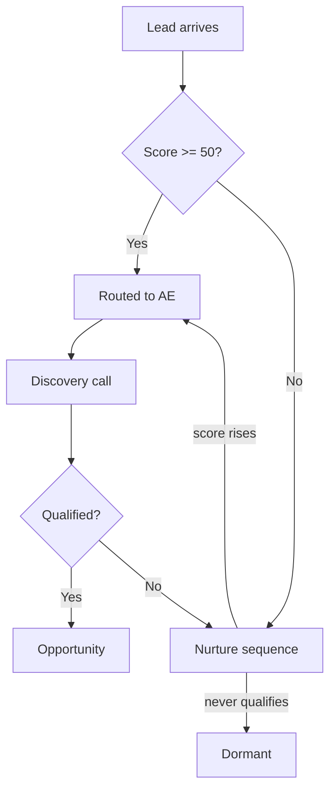

# Funnel Visualization

A funnel that isn't visualized doesn't communicate. This skill produces the diagrams and tables that make funnel design legible to humans.

## When to invoke

- The user explicitly asks for a diagram, flowchart, map, or visual
- You've finished designing a funnel — always produce a visual before delivering
- The user is comparing two funnel structures and a visual would clarify the difference
- The user is debugging a leak and needs to see the funnel shape

## The default: Mermaid

Mermaid renders natively in Markdown across most surfaces (Claude.ai, GitHub, Notion, most docs platforms). Use it as the default. Fall back to ASCII or table-only when Mermaid isn't supported.

## Diagram type selection

Pick the right diagram for the job.

| What you're showing | Best diagram type | Mermaid syntax |
|---------------------|-------------------|----------------|
| Sequential stages with conversion rates | Left-right flowchart with stage rates on arrows | `flowchart LR` |
| Looped funnel (PLG, retention loops) | Flowchart with feedback edges | `flowchart LR` with loop-back arrows |
| Multi-entry funnel (different channels into different stages) | Flowchart with multiple entry nodes | `flowchart LR` |
| Channel-to-stage attribution | Sankey diagram | `sankey-beta` |
| Customer journey across dimensions | Table (Mermaid doesn't render this well — use Markdown table) | Markdown table |
| Time-based progression / cohort | Gantt-like sequence | Mermaid `gantt` (rarely useful for funnels) |
| Decision points / branching logic | Flowchart with diamond decision nodes | `flowchart TD` |

If you're not sure, default to a left-to-right flowchart. It's the most read-friendly for funnels.

## Template 1: Linear funnel with conversion rates

Use for: transactional ecommerce, simple lead-gen, sales-led B2B.



Conventions:

- Stages are nodes
- Conversion rates label the arrows (`-->|8%|`)
- Absolute volumes in the stage node
- Highlight the leakiest stage in red (`fill:#fee,stroke:#900`)
- Highlight the best-performing stage in green (`fill:#efe,stroke:#090`)

## Template 2: Looped funnel (PLG with expansion)

Use for: PLG SaaS, subscription DTC, products with retention/expansion stages.



Conventions:

- Solid lines for primary flow
- Dashed lines for secondary loops (referral, churn, win-back)
- Loss states explicitly labeled

## Template 3: Multi-entry funnel (multiple channels)

Use for: businesses with significantly different paths by channel.



Conventions:

- Channels on the left feed into different stages based on intent
- Stages flow left-to-right
- Edge labels indicate buyer temperature

## Template 4: Bow Tie funnel (pre-sale + post-sale)

Use for: SaaS where NRR matters as much as new-logo.



Use subgraphs to visually separate the two halves of the bow tie.

## Template 5: Channel attribution Sankey

Use when: showing how channels contribute to each stage. Best with real attribution data.



Conventions:

- Channels feed into the first stage
- Conversions flow forward
- Lost branches show drop-off magnitude

## Template 6: Decision-branching funnel

Use when: the funnel has a real branching decision (PLG vs sales-assist split, qualified vs disqualified, etc.).



Conventions:

- Diamonds for decisions
- Both branch outcomes labeled
- Loops back to nurture for re-qualification

## Stage table (always include alongside the diagram)

Diagrams show shape; tables show specifics. Always produce both.

| # | Stage | Buyer state | Primary channels | Key asset | Primary KPI | Target / Benchmark |
|---|-------|-------------|------------------|-----------|-------------|-------------------|
| 1 | Visit | Unaware → Aware | SEO, Twitter, comparison pages | Homepage, /vs/competitor | Visit → Signup % | 8% (industry 5–10%) |
| 2 | Trial signup | Considering | In-product onboarding | Slack install flow | Signup → Activation % | 65% target (today: 35%) |
| 3 | Activated | Deciding | Day-1 lifecycle email | Team-invite flow | Activation → Paid % | 55% |
| 4 | Paid | Customer | Billing flow | Pricing page | Paid → Expansion % | 40% within 90d |
| 5 | Expansion | Advocate | In-product referral | Referral mechanic | NRR | 115%+ |

This format is the canonical "stage table" referenced by other skills.

## Customer journey map

When the user wants a journey map (deeper than a funnel — includes thoughts, feelings, touchpoints), use a multi-row table per stage.

| Dimension | Aware | Considering | Deciding | Customer | Advocate |
|-----------|-------|-------------|----------|----------|----------|
| **Actions** | Searches problem, asks peers | Reads comparison content, signs up for trial | Tests with team, checks pricing | Uses daily, may add seats | Refers others, leaves review |
| **Thoughts** | "Why is this so painful" | "Is this any better than what I have" | "Will the team actually use it" | "This is working" | "I should tell X about this" |
| **Feelings** | Frustrated | Curious + skeptical | Hopeful + anxious | Relieved | Loyal |
| **Touchpoints** | Google search, Twitter | Website, demo video, peer reco | In-product, sales email | Product, email, support | Referral page, community |
| **Pain points** | Doesn't know category exists | Generic comparison content | Onboarding friction, team adoption | Occasional bugs | Hard to refer without context |
| **Opportunity** | SEO content on the trigger | Specific comparison pages | Activation guarantee | Proactive expansion | One-click referral |

Use journey maps for narrative reports, customer-research presentations, and onboarding new team members to the funnel. They're heavier than a funnel diagram — don't overuse them.

## ASCII funnel (for quick chat responses)

When the user is on a surface that doesn't render Mermaid or you want to be compact:

```
[Visits        12,000] ━━━━━━━━━━━━━━━━━━━━━━━━━━━━━━━━━━━━
                          ↓ 8%
[Trial signups    960] ━━━━━━━━━━
                          ↓ 35% ⚠ LEAK
[Activated        336] ━━━
                          ↓ 55%
[Paid             185] ━━
                          ↓ 40%
[Expanded          74] ▪
```

Conventions:

- Bar length proportional to volume (rough)
- Conversion rate on each arrow
- Mark leaks with ⚠
- Compact enough for a Slack-like chat reply

## Rendering rules

1. **Always produce both a diagram AND a stage table.** They serve different cognitive needs (shape vs. detail).
2. **Match diagram complexity to funnel complexity.** A simple 3-stage funnel doesn't need a Sankey. A 7-stage multi-channel funnel needs more than ASCII.
3. **Highlight the action.** If there's a leak, color it. If there's a goal, mark it. Don't hand back a flat undifferentiated diagram.
4. **Label volumes AND rates.** Just rates without volumes hides scale; just volumes without rates hides efficiency.
5. **Show losses explicitly when they matter.** Most drop-off is invisible if you only show the forward path. For optimization conversations, draw the lost branches.
6. **Keep it readable.** If the diagram doesn't fit on a screen, it's too detailed. Split into nested diagrams.

## Common visualization failures

| Failure | Fix |
|---------|-----|
| Stage names that are channels ("Email", "Webinar") | Rename to buyer states ("Considering", "Evaluating") |
| Diagram without numbers | Add at least volume OR conversion rates |
| Numbers without periods | "12,000" is meaningless without "/mo" or "/quarter" |
| No drop-off shown | Add lost branches for stages where leak is the conversation |
| Channel-attribution diagram with made-up numbers | Either use real data or label as "illustrative" |
| Same color everywhere | Highlight what matters (leak, goal, milestone) |

## Output checklist

When this skill is invoked, it should produce:

- [ ] Mermaid diagram appropriate to the funnel type
- [ ] Accompanying stage table with KPIs and targets
- [ ] Visual highlighting of leaks (red) and strengths (green)
- [ ] Volume + conversion rate on each transition
- [ ] If the funnel is complex: journey map or Sankey as supplement
- [ ] ASCII fallback if the user's surface doesn't render Mermaid

## Reference files

- `references/mermaid-templates.md` — Full library of funnel diagram templates
- `references/journey-map-templates.md` — Customer journey map structures by business type

## Final guidance to the agent

The diagram is not decoration — it's communication. A good visualization tells the user where to look first. If you're producing a funnel where everything is the same color and weight, the visualization is failing its job. Pick the most important fact (the leak, the unlock, the bottleneck) and make it visually prominent.

And when the user is going to share the visual with a non-technical audience (founder presenting to a board, marketer presenting to leadership), simplify aggressively. Five-stage funnel with three highlighted numbers beats nine-stage funnel with rates everywhere.
