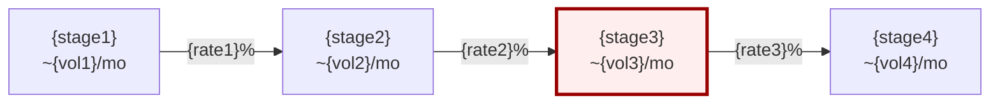
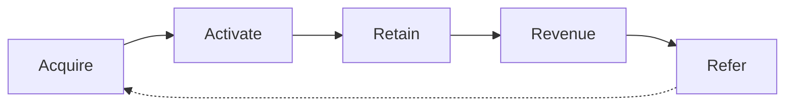
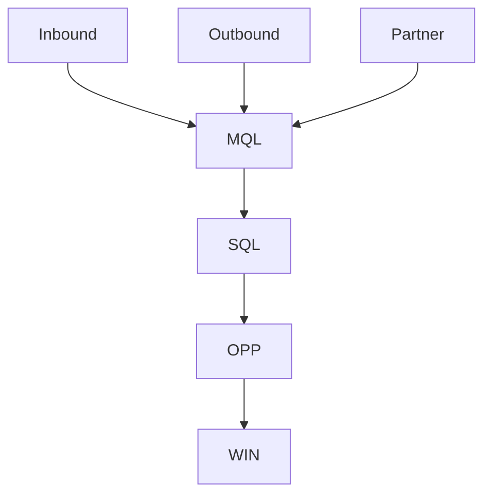
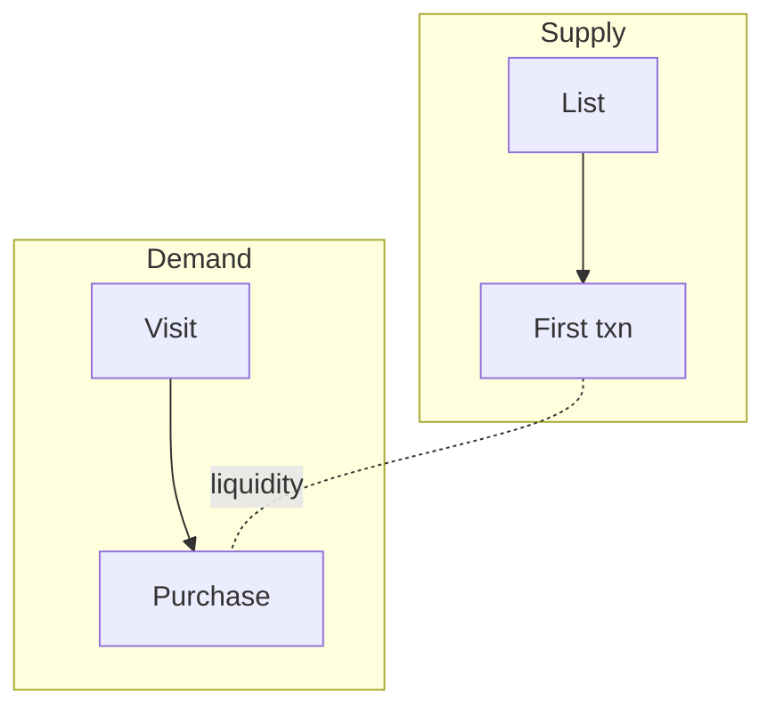

# Funnel Visualization

**Phase:** Map (3) · **Always include** in Funnel Spec output

## Purpose

Make funnel structure **scannable**: diagram + stage table together. Highlight leaks and expansion paths.

## Required outputs (pair always)

1. **Mermaid flowchart** (default)
2. **Stage table** — Stage | Buyer state | Channels | Assets | KPI | Current | Target

Diagram alone is **insufficient** for execution.

## Input requirements

From `funnel-frameworks`:

- Stage names (buyer states)
- Shape: linear, looped, multi-entry, parallel

From `funnel-metrics` (when available):

- Volumes per stage
- Conversion rates on edges

If volumes unknown → use `?` and list in open questions.

## Mermaid templates

### Linear funnel with leak highlight



- **Red style** = leak stage (primary optimization target)
- **Green style** = expansion / advocacy

### PLG loop (AARRR)



### Multi-entry enterprise



### Marketplace (two-sided)



Load `references/mermaid-templates.md` for copy-paste blocks.

## Stage table template

| Stage | Buyer state | Channels | Assets | KPI | Current | Target |
|-------|-------------|----------|--------|-----|---------|--------|
| 1 | Unaware → Aware | | | | | |
| 2 | Considering | | | | | |
| 3 | Deciding | | | | | |
| 4 | Customer | | | | | |
| 5 | Advocate | | | | | |

**Channels column** comes from `channel-playbooks` — never as stage names in diagram.

## Sankey / multi-channel attribution

When 5+ channels feed one stage:

- Prefer **attribution table** over unreadable diagram

| Channel | Volume in | Stage | % of stage |
|---------|-----------|-------|------------|
| SEO | 5000 | Aware | 42% |
| Paid | 3000 | Aware | 25% |

Note: Mermaid Sankey support varies — table is acceptable.

## Customer journey map

Use **only when**:

- 3+ stakeholders (enterprise)
- Sales cycle > 60 days
- User explicitly asks for journey map

Structure: stages × (Actions | Thoughts | Emotions | Touchpoints | Pain | Opportunities)

See `references/journey-map-templates.md`.

## Rendering rules

| Rule | Detail |
|------|--------|
| Max nodes | ~7 on primary path |
| Edge labels | Rate % and/or volume |
| Unknown data | `?` + open question |
| Complexity | Collapse micro-steps |
| Pairing | Every diagram → stage table |

See `references/rendering-rules.md`.

## ASCII fallback

When Mermaid unavailable:

```
[Visit 12K] --8%--> [Trial 960] --35%--> [Activated 336] --55%--> [Paid 185]
                              ^^^ leak
```

## Operational workflow

1. Receive stages + shape from `funnel-frameworks`
2. Attach volumes/rates from user or `funnel-metrics`
3. Select template (linear / loop / multi-entry / marketplace)
4. Highlight leak stage (red) if audit identified one
5. Render Mermaid
6. Fill stage table (all columns)
7. Add journey map appendix only if warranted

## Output location

Embed in Funnel Spec §2 (diagram) and §3 (table).  
Save full spec: `docs/marketing/funnels/{slug}-funnel-spec-{date}.md`

## Do not use when

- User wants numbers only → `funnel-metrics`
- User wants copy only → `conversion-copywriting`
- Framework not agreed → `funnel-frameworks` first

## Anti-patterns

| Mistake | Fix |
|---------|-----|
| Diagram without table | Always pair |
| Channel names as nodes | Buyer states as nodes |
| 15-node spaghetti | Collapse stages |
| Fake precision on volumes | Label estimates |

## Coordination

- **From funnel-frameworks:** Stages, shape
- **From channel-playbooks:** Channels column
- **From conversion-copywriting:** Assets column
- **From funnel-metrics:** KPI, Current, Target columns

## Quality checklist

- [ ] Mermaid renders valid syntax
- [ ] Stage table complete (7 columns)
- [ ] Leak highlighted if known
- [ ] Volumes/rates on edges where known
- [ ] ≤7 nodes on main path
- [ ] Channels not used as stage names

## References

- `references/mermaid-templates.md`
- `references/journey-map-templates.md`
- `references/rendering-rules.md`
