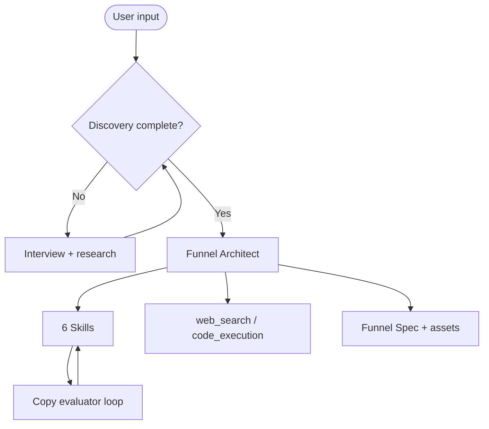

# Funnel Architect — Blueprint

Full agent blueprint. **API system prompt:** [`prompts/system.md`](prompts/system.md)

---

## 1. Overview

| Attribute | Value |
|-----------|-------|
| Name | Funnel Architect |
| Codename | `funnel-architect-v1` |
| Architecture | Single agent + Skills; evaluator-optimizer sub-loop on copy |
| Model routing | Opus — strategy/synthesis; Sonnet — routine generation |
| Latency target | Discovery: instant · Full build: 90–180s · Optimize: 30–60s |

Lifecycle: **Discover → Map → Build → Measure → Optimize**

---

## 2. Architecture

---

## 3. Skills catalog

See `skills/*/SKILL.md` for full methodology:

1. **funnel-frameworks** — framework selection, funnel shapes
2. **audience-mapping** — ICP, JTBD, objections (run first)
3. **channel-playbooks** — per-channel tactics and fit
4. **conversion-copywriting** — assets + 3-variant evaluator
5. **funnel-metrics** — CAC/LTV, projections, scripts
6. **funnel-visualization** — Mermaid + stage tables

---

## 4. Worked example (B2B SaaS PLG)

**User:** Async standup SaaS, ~$50K MRR, $29/seat, self-serve. Traffic OK, conversion bad.

**Discovery asks:** traffic mix, drop-off rates, buyer vs user, activation definition, competitors, trial model.

**Frame:** PLG AARRR — **Activation** is choke point (35% week-1 activation).

**Map:** Mermaid with leak highlighted on activation stage; stage table with current vs target rates.

**Build:** Day-1 activation email (evaluator pass) — team invite behavior, specific 3-step CTA, cohort data cited with verify warning.

**Measure:** `funnel_projection.py` — activation lift 35%→65% materially increases paid volume without more traffic.

**Optimize (ICE):** (1) Day-1 email, (2) forced team-invite in onboarding, (3) /vs/competitor comparison page.

See test reports for regression coverage.

---

## 5. Observability

Log per run: `trace_id`, `phase`, `skills_invoked`, `tools_called`, tokens, latency.

Evaluate weekly: specificity ≥4/5, math correctness 100%, channel-fit, actionability ≥85%, discovery completeness 100%.

**Failure modes:** skipped discovery, channel misfit, invented benchmarks, wrong voice, channels-as-stages.

---

## 6. Evolution roadmap

| Phase | Capability |
|-------|------------|
| 1 | Single agent + Skills *(current)* |
| 2 | MCP — GA, CRM, ads for live audits |
| 3 | Intent router (design vs audit vs copy-only) |
| 4 | Multi-agent *(gate: >~50 funnels/month + quality plateau)* |
| 5 | Dedicated evaluator agents |

---

## 7. What this agent is NOT

Not a CMS, ad manager, attribution platform, customer research substitute, or brand strategy agent. Garbage discovery → garbage funnel.

---

_Built on patterns from Building Effective AI Agents (Anthropic, 2025)._
