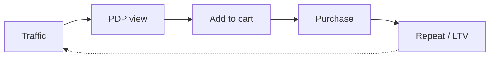

# DTC ecommerce funnel patterns

Load when business model = direct-to-consumer ecommerce (physical or digital goods).

## Default framework

**Awareness → Consideration → Purchase → Retention → Advocacy**

| Stage | Buyer state | Key assets |
|-------|-------------|------------|
| Awareness | Unaware → problem-aware | Ads, UGC, influencers, SEO |
| Consideration | Comparing options | PDP, reviews, comparison content |
| Purchase | Ready to buy | Cart, checkout, offers |
| Retention | Repeat buyer | Email, SMS, loyalty, replenishment |
| Advocacy | Referrer | UGC program, referrals, reviews |

## Funnel shape: linear with retention loop

## Stage KPIs (typical)

| Transition | Heuristic range | Notes |
|------------|-----------------|-------|
| Session → PDP | 40–70% | Depends on landing page |
| PDP → ATC | 8–15% | Category-dependent |
| ATC → Purchase | 50–70% | Checkout friction |
| 90d repeat rate | 15–35% | Consumables higher |

*Run benchmarks via web_search for category.*

## Channel-stage fit

| Stage | Primary channels |
|-------|------------------|
| Awareness | Meta, TikTok, influencers, YouTube |
| Consideration | SEO, retargeting, email capture |
| Purchase | Site, SMS abandoned cart |
| Retention | Email, SMS, loyalty app |

## Unit economics focus

- **AOV**, **CAC**, **contribution margin**, **LTV/CAC**
- Payback period matters more than top-of-funnel vanity

## Anti-patterns

- Optimizing CTR while checkout abandonment is 80%
- Discounting before proving product-market fit
- Treating one-time buyers as success (no retention plan)

## Subscription / replenishment variant

Add **subscribe & save** as parallel conversion path with separate KPIs (subscribe rate, churn).
