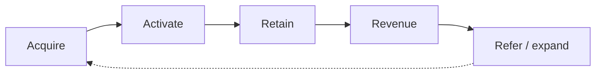

# B2B SaaS PLG funnel patterns

Load when motion = product-led growth. **Activation often matters more than acquisition.**

## Default framework: AARRR

| Stage | Buyer state | Typical leak | Primary KPI |
|-------|-------------|--------------|-------------|
| Acquisition | Aware → signed up | Wrong traffic quality | Visit → signup |
| Activation | Signed up → value moment | Onboarding friction | Signup → activated |
| Retention | Activated → habitual use | Weak habit loop | D7/D30 retention |
| Revenue | Habit → paid | Pricing/packaging mismatch | Trial → paid |
| Referral | Paid → advocate | No invite loop | Referral rate, viral coeff |

## Activation is the choke point when

- Traffic is adequate but paid conversion is low
- Trials start but don't reach "aha" in week 1
- Single-user signup without team expansion

**Fix order:** activation → onboarding → paywall timing → acquisition quality.

## PLG funnel shape: looped

## Team-expansion motion

| Role | Job in funnel |
|------|---------------|
| Champion (user) | Discovers, trials, activates |
| Economic buyer (manager/VP) | Approves spend, expands seats |
| Admin | Billing, security review |

Map **separate touchpoints** per role — don't write EM copy to engineers only.

## Stage definitions (must be explicit)

- **Signup** — account created
- **Activated** — *your* value moment (e.g., 3 users posted standup in 7 days)
- **Paid** — first invoice
- **Expanded** — added seats or upgraded tier in 90d

## Anti-patterns

- Optimizing ads when activation is <40%
- Freemium with no path to team value
- Treating signup as success

## Benchmark heuristics (verify via web_search)

| Metric | Early PLG | Mature PLG | Confidence |
|--------|-----------|------------|------------|
| Visit → signup | 2–8% | 5–12% | Likely |
| Signup → activated | 25–45% | 40–65% | Likely |
| Activated → paid | 40–60% | 55–75% | Likely |

*Label as heuristic until user's cohort data confirms.*
