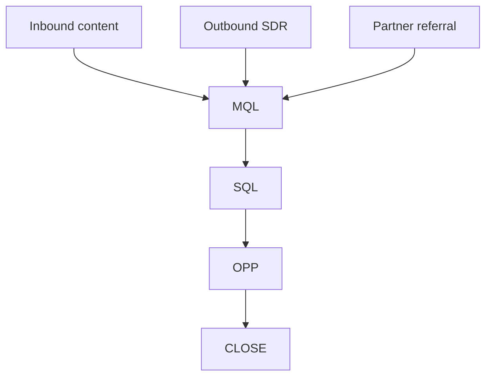

# B2B SaaS sales-led funnel patterns

Load when motion = sales-led or hybrid with outbound + inbound pipeline.

## Default framework: TOFU/MOFU/BOFU + pipeline

| Funnel stage | CRM stage | Buyer state |
|--------------|-----------|-------------|
| TOFU | Lead / MQL | Problem-aware, researching |
| MOFU | MQL → SQL | Evaluating solutions |
| BOFU | Opp → Close | Decision, procurement |
| Post-sale | Onboard → expand | Adopt → expand |

## Pipeline stages (typical)

```
Lead → MQL → SQL → Discovery → Demo → Proposal → Negotiation → Closed Won
```

**One primary conversion goal per funnel.** Enterprise "multi-entry" funnels share BOFU stages but differ at TOFU.

## MQL definition (must be written down)

Include: firmographic fit, intent signal, engagement threshold.

Example: "Director+ at 200–2000 employee SaaS, visited pricing 2×, downloaded ROI calc."

## Multi-entry shape



## KPIs by stage

| Stage | KPI | Guardrail |
|-------|-----|-----------|
| TOFU | MQL volume, CPL | MQL→SQL rate |
| MOFU | SQL conversion, demo show rate | Opp create rate |
| BOFU | Win rate, sales cycle days | Discount rate |
| Expansion | NRR, expansion pipeline | Churn |

## When sales-led fits

- ACV > ~$15K or complex multi-stakeholder buy
- Implementation / security review required
- Category creation (education before demo)

## Anti-patterns

- MQL definitions that inflate top of funnel
- SDR outbound for sub-$500/mo self-serve SKUs
- One generic nurture for inbound vs outbound leads

## Benchmark heuristics (verify)

| Metric | B2B SaaS mid-market | Confidence |
|--------|---------------------|------------|
| MQL → SQL | 15–30% | Likely |
| SQL → Opp | 50–70% | Likely |
| Opp → Win | 20–35% | Likely |
| Sales cycle | 30–90 days | Varies widely |
