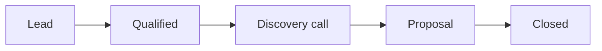

# High-touch services funnel patterns

Load for agencies, consultancies, professional services, and high-touch B2B services.

## Default framework

**Lead gen → Qualify → Discover → Propose → Close → Deliver → Expand**

| Stage | Buyer state | Goal |
|-------|-------------|------|
| Lead gen | Aware of problem | Capture interest |
| Qualify | Fit assessment | Disqualify fast |
| Discover | Trust building | Uncover scope + budget |
| Propose | Decision | Win the engagement |
| Deliver | Customer | Prove ROI |
| Expand | Advocate | Upsell / referral |

## Funnel shape: linear, high friction

## Qualification criteria (BANT+)

- **Budget** — can they afford your floor?
- **Authority** — who signs?
- **Need** — urgent, painful, articulated?
- **Timeline** — buying window?
- **Fit** — you can deliver outcomes they care about

## KPIs

| Stage | KPI | Target heuristic |
|-------|-----|------------------|
| Lead → Qualified | Qualification rate | 20–40% |
| Qualified → Discovery | Book rate | 50–70% |
| Discovery → Proposal | Proposal rate | 60–80% |
| Proposal → Close | Win rate | 25–45% |

## Channel-stage fit

| Stage | Channels |
|-------|----------|
| Lead gen | SEO, LinkedIn, referrals, speaking, partnerships |
| Nurture | Email, case studies, webinars |
| Close | Calls, proposals, references |

## Anti-patterns

- Proposal before discovery (scope creep, low win rate)
- No disqualification (wasted sales time)
- Generic case studies without ICP match

## Pricing in funnel

Services often price **after** discovery. Funnel should include:

- **Price anchor** on site (starting at / typical engagement)
- **Risk reversal** (pilot, milestone billing)
