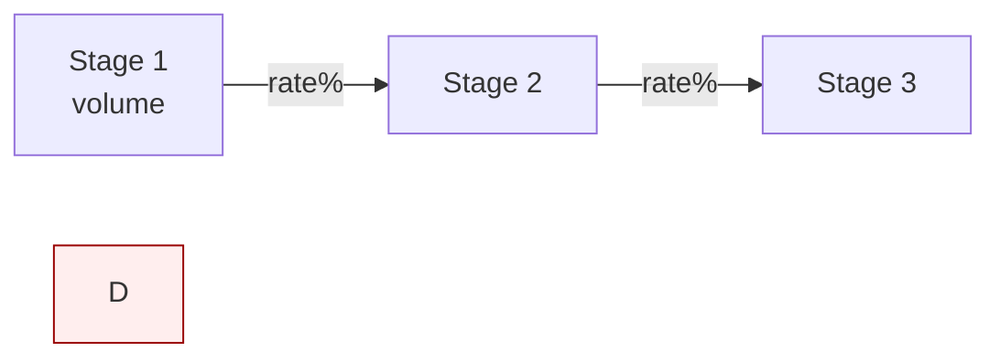
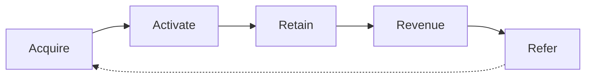

# Funnel Visualization

**Used by:** Funnel Architect (Phase 3 — Map)

## Default outputs

1. **Mermaid flowchart** — linear, looped, or multi-entry
2. **Stage table** — Stage | Buyer state | Channels | Assets | KPI | Current | Target
3. **Optional:** customer journey map (actions, thoughts, touchpoints, pain, opportunities)

## Mermaid templates

### Linear funnel

Highlight leak stage with `style` (red) and expansion with green.

### PLG loop

## Sankey-style (complex multi-channel)

Describe channel → stage flows in table if Mermaid Sankey unsupported; note volumes at each merge.

## Rendering rules

- Include **volumes and rates** on edges when data available
- Don't diagram 15 nodes — simplify to decision-relevant stages
- Pair every diagram with the stage table (diagram alone is insufficient)

## References

- `references/mermaid-templates.md`
- `references/journey-map-templates.md`
- `references/rendering-rules.md`
