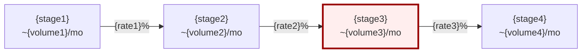
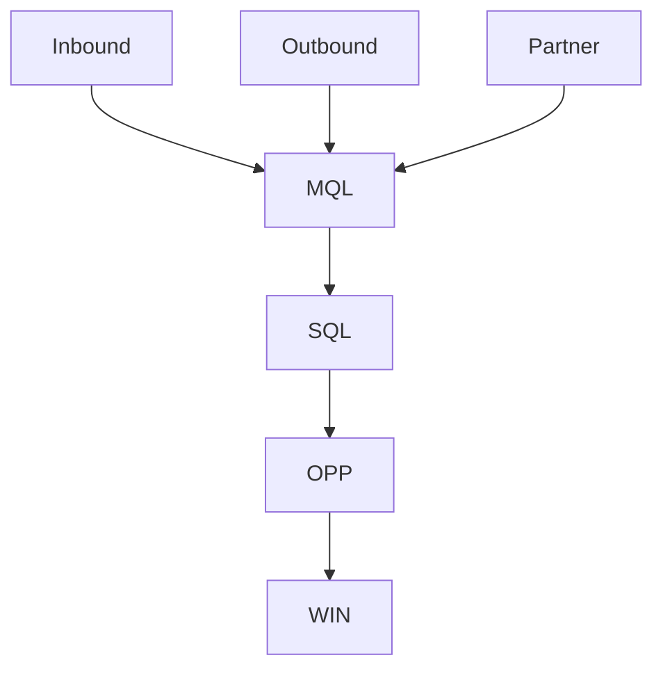
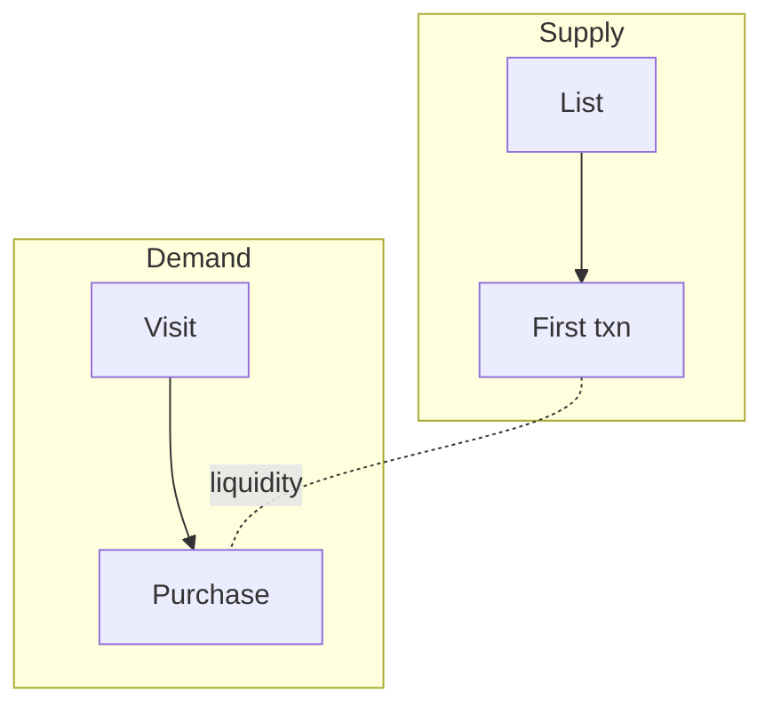

# Mermaid funnel templates

Copy and replace placeholders: `{stage}`, `{volume}`, `{rate}`.

## Linear funnel with leak highlight

Use `style` red on leak stage, green on expansion.

## PLG loop (AARRR)

## Multi-entry enterprise

## Marketplace (two-sided)

## Stage table (always pair with diagram)

| Stage | Buyer state | Channels | Assets | KPI | Current | Target |
|-------|-------------|----------|--------|-----|---------|--------|
| | | | | | | |

## Rendering rules

- Max 7 nodes on main path (collapse micro-steps)
- Show volumes **and** rates on edges when known
- If data unknown, label `?` and list in open questions
