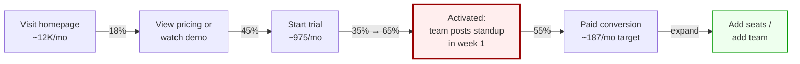

# Funnel Architect — worked example

Full session trace from blueprint §6. Use for v1 eval: verify all 6 phases execute.

---

## User prompt

> I run a B2B SaaS doing async standup tools for engineering teams. ~$50K MRR, $29/seat/mo, mostly self-serve. We're getting traffic but conversion to paid is bad. Help me fix the funnel.

---

## Phase 1 — Discovery

Agent invokes `audience-mapping` + `funnel-frameworks`. Expected questions:

1. Traffic source mix (%)
2. Visit → signup → activated → paid rates
3. Who buys vs who uses
4. Activation definition
5. Closest competitor
6. Free trial or freemium structure

---

## Phase 2 — Frame (after user answers)

- **Audience:** EMs at 10–50 person eng teams; buyer = EM; user = team
- **Offer:** $29/seat/mo, 14-day trial, self-serve
- **Goal:** Lift visit → paid (~0.8% → 2%+)
- **Leak:** Signup → activated (35% post standup week 1)
- **Type:** PLG AARRR — **Activation** is choke point

---

## Phase 3 — Map



| Stage | Buyer state | Primary channel | Key asset | KPI | Current | Target |
|-------|-------------|-----------------|-----------|-----|---------|--------|
| Visit | Unaware → Aware | SEO, Twitter, comparison | Homepage, /vs/geekbot | Visit→Trial | 8% | 10% |
| Trial signup | Considering | Trial flow | Onboarding, Slack install | Signup→Activation | **35%** | **65%** |
| Activation | Deciding | Email, in-app | Day-1 email, invite flow | Activation→Paid | 55% | 65% |
| Paid | Customer | Billing | Pricing page | Paid→Expansion | — | 40% in 90d |
| Expansion | Advocate | Referral | Team invite | NRR | — | 115% |

---

## Phase 4 — Build (evaluator pass on day-1 email)

**Subject:** `Your team won't use this if you don't do one thing today`

Key evaluator checks: audience hero, specific promise, objection pre-empt, clear CTA, substantiated cohort claim (78% vs 12% — must verify).

---

## Phase 5 — Measure

```bash
python funnel-architect/skills/funnel-metrics/scripts/funnel_projection.py --json
```

Current → ~185 paid/mo, ~$26.8K new MRR. Target activation lift → ~507 paid/mo, ~$73.5K new MRR.

---

## Phase 6 — ICE tests

| # | Test | ICE |
|---|------|-----|
| 1 | Day-1 activation email rewrite | 648 |
| 2 | Force team-invite step 2 onboarding | 392 |
| 3 | /vs/geekbot comparison page | 252 |

**Open questions:** Validate EM vs VP buyer; verify 78%/12% cohort data before sending.

---

## Eval checklist

- [ ] Discovery asked ≥6 inputs before build
- [ ] Channels not conflated with stages
- [ ] Math via code_execution
- [ ] Mermaid + stage table both present
- [ ] 3 ICE tests with scores
- [ ] No fabricated benchmarks without label
