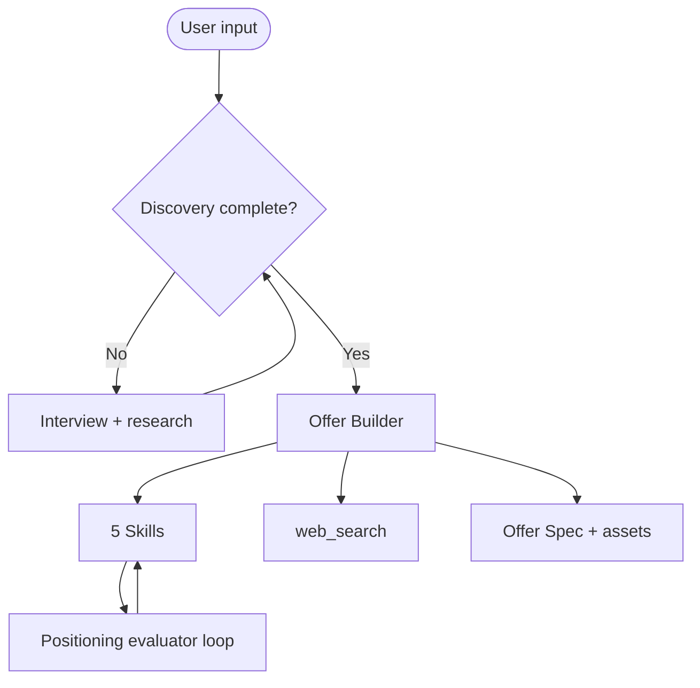
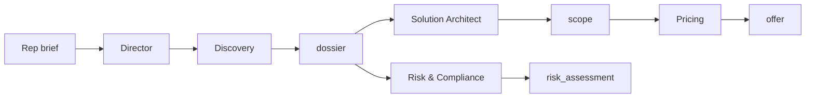

# Offer Builder — Blueprint (Marketing mode)

> **Enterprise B2B commercial offers:** see [`OFFER-BUILDER-SPEC.md`](OFFER-BUILDER-SPEC.md) · Entry: `offer-director`

Full marketing blueprint. **API system prompt:** [`prompts/system.md`](prompts/system.md)

---

## 1. Overview

| Attribute | Value |
|-----------|-------|
| Name | Offer Builder |
| Codename | `offer-builder-v1` |
| Architecture | Dual mode: (A) Marketing single agent + Skills; (B) Enterprise multi-agent pipeline with catalog tools |
| Model routing | Opus — strategy/synthesis and Solution Architect; Sonnet — routine generation |
| Latency target | Marketing: 60–120s · Enterprise scope: 30–90s (catalog-dependent) |

**Mode A — Marketing/GTM:** Discover → Position → Propose → Architect → Package → Validate  
**Mode B — Enterprise/Catalog:** Director → Discovery → [Solution Architect ∥ Risk] → Pricing → Copy → Evaluator

See [`prompts/offer-builder-system-prompts.md`](prompts/offer-builder-system-prompts.md) for Enterprise sub-agents.

---

## 2. Architecture

### Mode A — Marketing / GTM

### Mode B — Enterprise / Catalog

**Solution Architect** ([`prompts/agents/solution-architect.md`](prompts/agents/solution-architect.md)): catalog-grounded `scope` → Pricing. Schema: [`schemas/offer-schema.json`](schemas/offer-schema.json).

---

## 3. Skills catalog

See `skills/*/SKILL.md` for full methodology:

1. **positioning-frameworks** — category, differentiation, competitive frame
2. **value-proposition-design** — value equation, proof ladder, messaging hierarchy
3. **offer-architecture** — offer stack, tiers, bonuses, guarantees
4. **pricing-packaging** — pricing model, anchoring, packaging decisions
5. **offer-validation** — ICE tests, message experiments, assumption log

### Enterprise / Catalog skills

6. **solution-catalog** — need→family mapping, implementation_minimum, tier limits
7. **offer-templates** — milestone templates by deal_type

Sub-agents: see [`prompts/offer-builder-system-prompts.md`](prompts/offer-builder-system-prompts.md)

---

## 4. Worked example (B2B SaaS reposition)

**User:** Project management tool for agencies. Crowded category. $49/user/mo. Churn from "good enough" incumbents.

**Discovery asks:** ICP segment, switching trigger, current win/loss reasons, proof assets, price sensitivity.

**Position:** Narrow to **"client-facing project delivery for boutique agencies (5–25 people)"** — not generic PM. Category: **Client Delivery OS** (not "project management").

**Propose:** Value prop on **client transparency + scope creep prevention**. Proof ladder: case study metric → demo behavior → guarantee.

**Architect:** Core offer = platform + client portal + scope templates. Bonus = onboarding workshop. Guarantee = 60-day ROI or refund.

**Package:** Anchor at $79/user (competitor tier), sell at $49 with annual prepay. Land with 3-seat minimum.

**Validate (ICE):** (1) Category label A/B on homepage, (2) guarantee vs no-guarantee on pricing page, (3) ICP-specific case study ad.

See `worked-example.md` for full session trace.

---

## 5. Observability

Log per run: `trace_id`, `phase`, `skills_invoked`, `tools_called`, tokens, latency.

Evaluate weekly: specificity ≥4/5, differentiation clarity, proof completeness, actionability ≥85%, discovery completeness 100%.

**Failure modes:** generic positioning, feature-list value props, pricing without anchoring logic, claims without proof ladder, skipping competitive context.

---

## 6. Evolution roadmap

| Phase | Capability |
|-------|------------|
| 1 | Single agent + Skills *(Marketing mode)* |
| 1b | Enterprise hierarchy — **7/7 agents installed**; MCP tools pending |
| 2 | MCP — catalog.product.search, CRM win/loss, deals.history |
| 3 | Intent router (reposition vs new offer vs packaging-only) |
| 4 | Multi-agent *(gate: >~30 offer builds/month + quality plateau)* |

---

## 7. What this agent is NOT

Not a funnel designer (use Funnel Architect), not a copywriter (use copy-agent), not competitive research (use Scout), not legal review (use compliance). Garbage discovery → garbage offer.

---

_Built on patterns from Building Effective AI Agents (Anthropic, 2025)._
