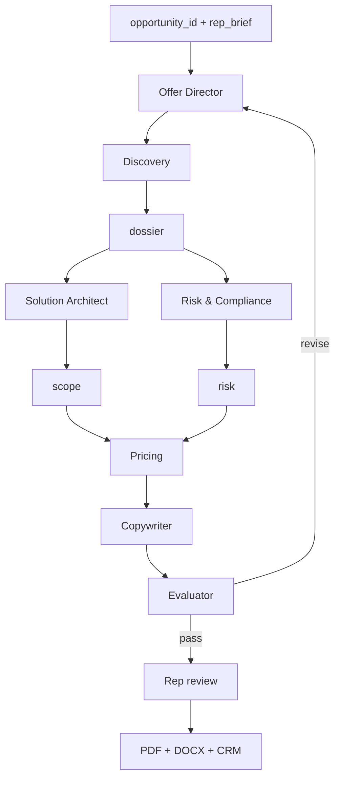

# Offer Builder — System Prompts Index

Multi-agent **Enterprise / Catalog** workflow for deal-desk quoting. Each sub-agent follows: **ROLE → INPUTS → PROCESS → HARD RULES → OUTPUT → PRINCIPLES**.

**Architecture:** [`OFFER-BUILDER-SPEC.md`](../OFFER-BUILDER-SPEC.md)  
**Schemas:** [`schemas/README.md`](../schemas/README.md)

---

## Workflow



| Step | Agent | Output | `subagent_type` | Status |
|------|-------|--------|-----------------|--------|
| 0 | **Offer Director** | offer + audit_log | `offer-director` | **Installed** |
| 1 | **Discovery** | `dossier` | `offer-discovery` | **Installed** |
| 2 | **Solution Architect** | `scope` | `solution-architect` | **Installed** |
| 2 | **Risk & Compliance** | `risk` | `offer-risk-compliance` | **Installed** |
| 3 | **Pricing** | `pricing` | `offer-pricing` | **Installed** |
| 4 | **Copywriter** | `narrative` | `offer-copywriter` | **Installed** |
| 5 | **Evaluator** | `evaluator_result` | `offer-evaluator` | **Installed** |

---

## Sub-agent prompts

| Agent | File | Schema |
|-------|------|--------|
| **Director** | [`prompts/agents/director.md`](agents/director.md) | `offer-schema.json` + `audit-log-schema.json` |
| **Discovery** | [`prompts/agents/discovery.md`](agents/discovery.md) | `dossier-schema.json` |
| **Solution Architect** | [`prompts/agents/solution-architect.md`](agents/solution-architect.md) | `scope-agent-schema.json` → `offer.scope` |
| **Risk & Compliance** | [`prompts/agents/risk-compliance.md`](agents/risk-compliance.md) | `risk-schema.json` → `offer.risk` |
| **Pricing** | [`prompts/agents/pricing.md`](agents/pricing.md) | `pricing-schema.json` → `offer.pricing` |
| **Copywriter** | [`prompts/agents/copywriter.md`](agents/copywriter.md) | `narrative-schema.json` → `offer.narrative` |
| **Evaluator** | [`prompts/agents/evaluator.md`](agents/evaluator.md) | `evaluator-result-schema.json` → `offer.evaluator_result` |

---

## Enterprise skills

| Skill | Agents |
|-------|--------|
| `customer-discovery` | Discovery, Director |
| `solution-catalog` | Solution Architect |
| `pricing-policy` | Pricing, Director |
| `legal-terms` | Risk & Compliance |
| `offer-templates` | Director, SA, Copywriter |
| `competitive-positioning` | Copywriter, Pricing |

---

## Tools

| Tool | Used by |
|------|---------|
| CRM (`opportunity`, `account`, `activity`) | Discovery, Director |
| `gong.transcript.search`, `email.thread.read` | Discovery |
| `catalog.product.search`, `catalog.dependencies.check` | Solution Architect |
| `pricing_engine.*` | Pricing |
| `clm.clauses.search`, `clm.precedent.search` | Risk |
| `compliance.jurisdiction.check` | Risk |
| `deals.history.search` | Pricing, SA, Director |
| `docgen.render`, `approval.route` | Director |

---

## Invoke

```
Task → subagent_type: offer-director       # opportunity_id + rep_brief (full pipeline)
Task → subagent_type: offer-discovery      # dossier only
Task → subagent_type: solution-architect
Task → subagent_type: offer-pricing
Task → subagent_type: offer-risk-compliance
Task → subagent_type: offer-copywriter
Task → subagent_type: offer-evaluator
```

---

## Evaluator rubric (§7)

Six dimensions 0–3, min pass = 2. Max **3 iterations** → `escalate_human`.

| Dimension | Owner on fail |
|-----------|---------------|
| completeness | director |
| consistency | solution_architect / pricing |
| policy | pricing / risk |
| grounding | copywriter / discovery |
| tone / differentiation | copywriter |

---

## Marketing mode (separate)

GTM positioning → [`prompts/system.md`](system.md) · `subagent_type: offer-builder`
