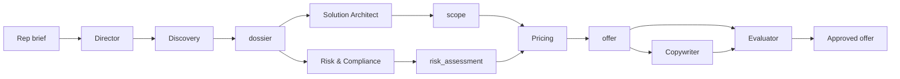

# Offer Builder — System Prompts Index

Multi-agent **Enterprise / Catalog** workflow for deal-desk quoting. Each sub-agent follows: **ROLE → INPUTS → PROCESS → HARD RULES → OUTPUT → PRINCIPLES**.

**Schemas:** [`schemas/offer-schema.json`](../schemas/offer-schema.json) · [`dossier-schema.json`](../schemas/dossier-schema.json) · [`risk-schema.json`](../schemas/risk-schema.json) · [`copy-schema.json`](../schemas/copy-schema.json) · [`evaluation-schema.json`](../schemas/evaluation-schema.json)

**Director orchestration:** `prompts/agents/director.md` *(pending — main spec)*  
**Pricing:** `prompts/agents/pricing.md` *(pending — main spec)*

---

## Workflow



| Step | Agent | Output block | `subagent_type` | Status |
|------|-------|--------------|-----------------|--------|
| 1 | **Director** | orchestration | `offer-builder` (director mode) | Pending |
| 2 | **Discovery** | `dossier` | `offer-discovery` | **Installed** |
| 3 | **Solution Architect** | `scope` | `solution-architect` | **Installed** |
| 3 | **Risk & Compliance** | `risk_assessment` | `offer-risk-compliance` | **Installed** |
| 4 | **Pricing** | `pricing` | `offer-pricing` *(TBD)* | Pending |
| 5 | **Copywriter** | `copy` | `offer-copywriter` | **Installed** |
| 6 | **Evaluator** | `evaluation` | `offer-evaluator` | **Installed** |

---

## Sub-agent prompts

| Agent | File | Schema |
|-------|------|--------|
| Director | `prompts/agents/director.md` | — |
| **Discovery** | [`prompts/agents/discovery.md`](agents/discovery.md) | `dossier-schema.json` |
| **Solution Architect** | [`prompts/agents/solution-architect.md`](agents/solution-architect.md) | `offer-schema.json#scope` |
| **Risk & Compliance** | [`prompts/agents/risk-compliance.md`](agents/risk-compliance.md) | `risk-schema.json` |
| Pricing | `prompts/agents/pricing.md` | `offer-schema.json#pricing` |
| **Copywriter** | [`prompts/agents/copywriter.md`](agents/copywriter.md) | `copy-schema.json` |
| **Evaluator** | [`prompts/agents/evaluator.md`](agents/evaluator.md) | `evaluation-schema.json` |

---

## Required tools (Enterprise mode)

| Tool | Used by |
|------|---------|
| `crm.opportunity.get`, `crm.account.get`, `crm.activity.search` | Discovery |
| `gong.transcript.search`, `email.thread.read` | Discovery |
| `catalog.product.search`, `catalog.dependencies.check`, `catalog.integrations` | Solution Architect, Pricing |
| `deals.history.search` | Solution Architect, Pricing |
| `compliance.jurisdiction.check` | Risk & Compliance |
| `clm.clauses.search`, `clm.precedent.search` | Risk & Compliance |

**Skills:** `solution-catalog`, `offer-templates`, `competitive-positioning`

---

## Invoke

```
Task → subagent_type: offer-discovery      # opportunity_id + rep_brief
Task → subagent_type: solution-architect   # dossier + rep_brief
Task → subagent_type: offer-risk-compliance
Task → subagent_type: offer-copywriter
Task → subagent_type: offer-evaluator
```

---

## Evaluator revision routing

| Failed dimension | Owner agent |
|------------------|-------------|
| completeness | director |
| consistency | solution_architect / pricing |
| policy | pricing / risk |
| grounding | copywriter / discovery |
| tone / differentiation | copywriter |

Max **3 iterations** → `escalate_human`

---

## Marketing mode (separate)

GTM positioning without catalog → [`prompts/system.md`](system.md) + marketing skills.

See [`offer-builder-agent.md`](../offer-builder-agent.md).
