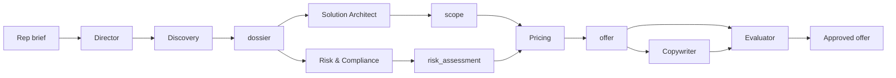

# Offer Builder — System Prompts Index

Multi-agent **Enterprise / Catalog** workflow for deal-desk quoting. Each sub-agent follows: **ROLE → INPUTS → PROCESS → HARD RULES → OUTPUT → PRINCIPLES**.

**Schema:** [`schemas/offer-schema.json`](../schemas/offer-schema.json)  
**Director orchestration:** `prompts/agents/director.md` *(pending — main spec)*

---

## Workflow



| Step | Agent | Output block | Runs |
|------|-------|--------------|------|
| 1 | **Director** | orchestration | Always |
| 2 | **Discovery** | `dossier` | After rep brief accepted |
| 3 | **Solution Architect** | `scope` | After dossier; parallel with Risk |
| 3 | **Risk & Compliance** | `risk_assessment` | After dossier; parallel with SA |
| 4 | **Pricing** | `pricing` | After `scope` (+ risk flags) |
| 5 | **Copywriter** | `copy` | After pricing draft |
| 6 | **Evaluator** | `evaluation` | Gates final output |

---

## Sub-agent prompts

| Agent | File | Status |
|-------|------|--------|
| Director | `prompts/agents/director.md` | Pending |
| Discovery | `prompts/agents/discovery.md` | Pending |
| **Solution Architect** | [`prompts/agents/solution-architect.md`](agents/solution-architect.md) | **Installed** |
| Risk & Compliance | `prompts/agents/risk-compliance.md` | Pending |
| Pricing | `prompts/agents/pricing.md` | Pending |
| Copywriter | `prompts/agents/copywriter.md` | Pending |
| Evaluator | `prompts/agents/evaluator.md` | Pending |

---

## Required tools (Enterprise mode)

| Tool | Used by | Purpose |
|------|---------|---------|
| `catalog.product.search` | Solution Architect, Pricing | Retrieve real SKUs and options |
| `catalog.dependencies.check` | Solution Architect | Validate bundle compatibility |
| `catalog.integrations` | Solution Architect | Check integration coverage |
| `deals.history.search` | Solution Architect, Pricing | Precedent and deviation checks |

Skills: `solution-catalog`, `offer-templates`

---

## Invoke (CEO / Offer Builder Director)

```
Task → subagent_type: solution-architect
```

Pass: `dossier`, `rep_brief`, optional `prior_deal_id`.

---

## Marketing mode (separate)

GTM positioning and offer architecture without catalog tools → [`prompts/system.md`](system.md) + marketing skills (`positioning-frameworks`, etc.).

See [`offer-builder-agent.md`](../offer-builder-agent.md) for dual-mode architecture.
